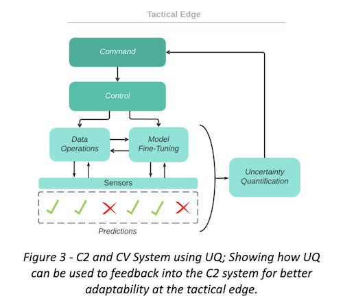

# Research Projects

## CNN Interpretability

{: .project-image}

**SaTML 2024 CNN Interpretability Competition (2nd Place)**

Our team developed innovative methods for concept-level interpretability in convolutional neural networks, achieving 2nd place in the IEEE SaTML 2024 competition. We focused on extracting human-understandable concepts from CNN models and mapping them to model predictions.

**Key contributions:**
- Novel approach to decompose CNN decisions into interpretable concepts
- Feature extraction techniques to identify critical network activations
- Visualization tools to help explain model decisions to non-expert users

## Adversarial Machine Learning

**Understanding Bias Transfer in Fine-tuned Models**

Investigating how biases present in foundation models transfer to fine-tuned child models, with a focus on developing methodology to detect and quantify this transfer. This work has implications for ethical AI deployment and fairness considerations.

**Research components:**
- Development of query-access fairness evaluation techniques
- Analysis of bias amplification during transfer learning
- Methods to mitigate unwanted bias transfer during fine-tuning

## Computer Vision at the Tactical Edge

{: .project-image}

**Adaptability of Computer Vision in Uncertain Environments**

This project addresses the challenges of deploying computer vision systems in tactical edge environments where conditions are unpredictable. The research focuses on developing models that can adapt to changing environmental conditions while maintaining performance reliability.

**Key innovations:**
- Lightweight adaptation techniques for resource-constrained environments
- Domain adaptation methods for shifting visual conditions
- Performance monitoring systems for reliability in mission-critical applications

## Juneberry Framework

**Simulating Attacks on Machine Learning Systems**

Contributing to the development of Juneberry, an open-source framework for simulating adversarial attacks on machine learning systems. This tool enables researchers and practitioners to evaluate the robustness of their models against various attack vectors.

**Features:**
- Comprehensive library of adversarial attack methods
- Evaluation metrics for model robustness
- Integration with popular ML frameworks
- Tools for visualizing attack impacts on model performance
