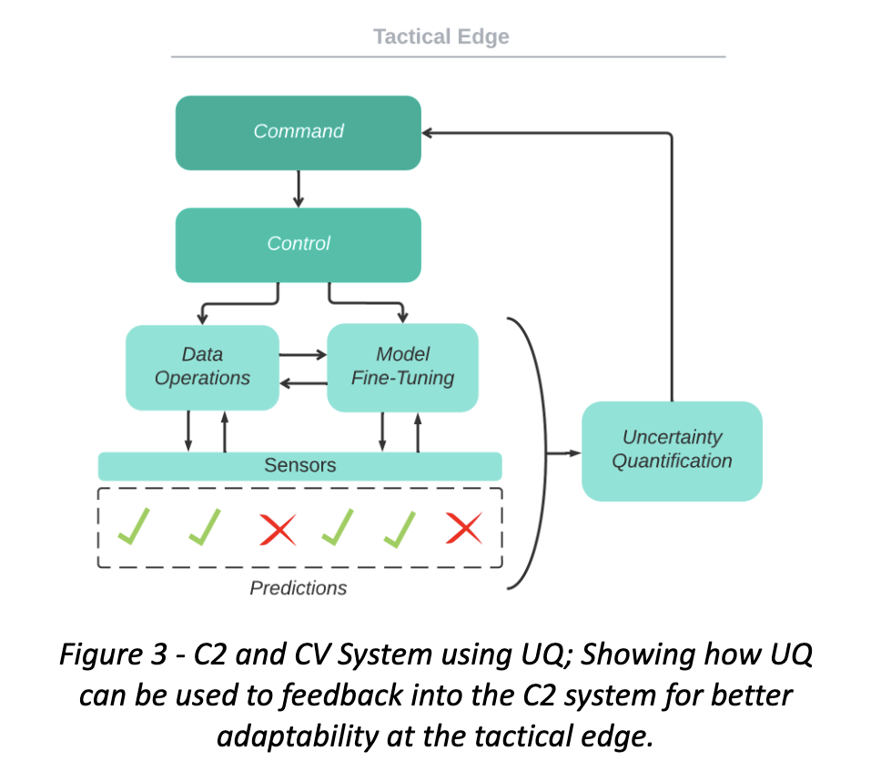
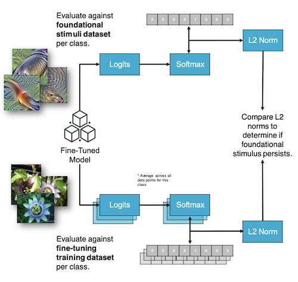

# Publications

## Conference Papers & Competitions

---

### 2024

**The SaTML '24 CNN Interpretability Competition: New Innovations for Concept-Level Interpretability**  
Stephen Casper, Jieun Yun, Joonhyuk Baek, Yeseong Jung, Minhwan Kim, Kiwan Kwon, Saerom Park, **Hayden Moore**, David Shriver, Marissa Connor, Keltin Grimes, Angus Nicolson, Arush Tagade, Jessica Rumbelow, Hieu Minh Nguyen, Dylan Hadfield-Menell  
*Follow-up report for 2nd IEEE Conference on Secure and Trustworthy Machine Learning (SaTML)*  
Toronto, Canada, 2024  
[arXiv:2404.02949](https://arxiv.org/abs/2404.02949)

{: .publication-image}

**🏆 Competition Achievement:**  
2nd Place, IEEE Conference on Secure and Trustworthy Machine Learning, SaTML: CNN Interpretability Competition (2024)  
[Competition Website](https://benchmarking-interpretability.csail.mit.edu/challenges-and-prizes/)

----------------------

### 2023

**Adaptability of Computer Vision at the Tactical Edge: Addressing Environmental Uncertainty**  
**Hayden Moore**  
*The 28th annual International Command and Control Research and Technology Symposium (ICCRTS)*  
Baltimore, MD, 2023  
[arXiv:2312.00269](https://arxiv.org/abs/2312.00269)

{: .publication-image}

**🏆 Award:**  
Best Paper Nominee for the 28th annual International Command and Control Research and Technology Symposium (ICCRTS)  
[Best Paper Nominations](https://internationalc2institute.org/28th-iccrts-best-paper-nominations)

----------------------
### 2023
**Understanding Bias Transfer from Foundational Models to Fine-tuned Child Models**  
Sinha, A., **Moore, H.**, VanHoudnos N.  
*Conference on Applied Machine Learning for Information Security (CAMLIS)*  
Arlington, VA, 2023  
[Conference Website](https://www.camlis.org/) | [PDF](https://github.com/HaydenMM/Research/blob/main/CAMLIS2023_CR_poster.pdf)

{: .publication-image}

---

## Technical Reports

---

### 2023

**Leveraging Adversarial Machine Learning Techniques to Perform Query-Access Fairness Evaluations**  
Sinha, A., **Moore, H.**, VanHoudnos, N.  
*Software Engineering Institute's (SEI) 2023 Research Review*  
Pittsburgh, PA, 2023  
[SEI Research Review](https://www.sei.cmu.edu/publications/annual-reviews/2023-research-review/research-review-article.cfm?customel_datapageid_326381=495673)

---

### 2022

**Juneberry Version 0.5 Simulates Attacks on Machine Learning Systems**  
Mellinger, A., Brown, B., Churilla, M., Gallagher, S., Helland, J., Justice, D., Mittermeier, D., **Moore, H.**, Nichols, W., Shaw, W., Sinha, A., VanHoudnos, N., Widjaja, J., Winski, N., Zucca, J.  
*Software Engineering Institute's (SEI) 2022 Research Review*  
Pittsburgh, PA, 2022  
[SEI Year in Review](https://www.sei.cmu.edu/publications/annual-reviews/2022-year-in-review/year_in_review_article.cfm?customel_datapageid_315013=494000)

---

### 2020

**AI Collaboration Supports U.S. Army Operations**  
Graham, D., Heim, E., Helland, J., McCarthy, R., **Moore, H.**, Morales, J., Palat, J., Smith, C., Deusen, A., Widjaja, J., Wright, O.  
*Software Engineering Institute's (SEI) 2020 Research Review*  
Pittsburgh, PA, 2020  
[SEI Year in Review](https://www.sei.cmu.edu/publications/annual-reviews/2020-year-in-review/year_in_review_article.cfm?customel_datapageid_315013=315523)

---

## Invited Talks

---

### 2024
**CNN Interpretability: Competition Results**  
*IEEE SaTML'24, University of Toronto, CA*, 2024

---

### 2023
**State-of-the-art Ship Detection Algorithms**  
*Software Engineering Institute and Office of Naval Research Summit*, 2023

---

### 2023
**Data Pipelines for Object Detection at the Tactical Edge**  
*Software Engineering Institute AI Workforce Development Lunch Series*, 2023

---

### 2021
**Technical Underpinnings of Decentralized Blockchains**  
Guest speaker for Robert Beveridge's Cryptography course (95-745) at Carnegie Mellon University  
Pittsburgh, PA, 2021

---
